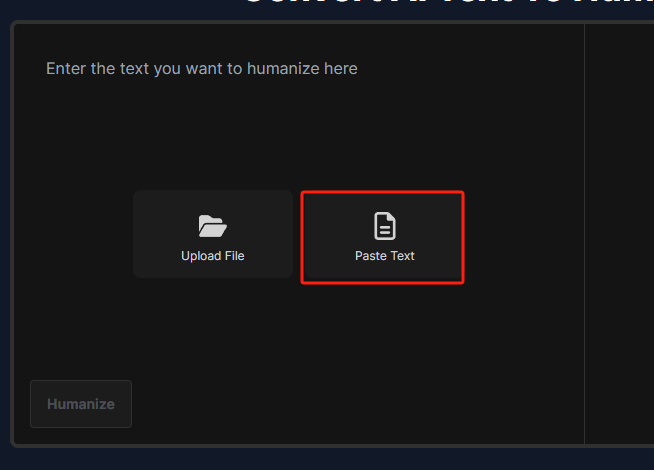
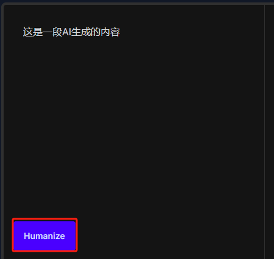
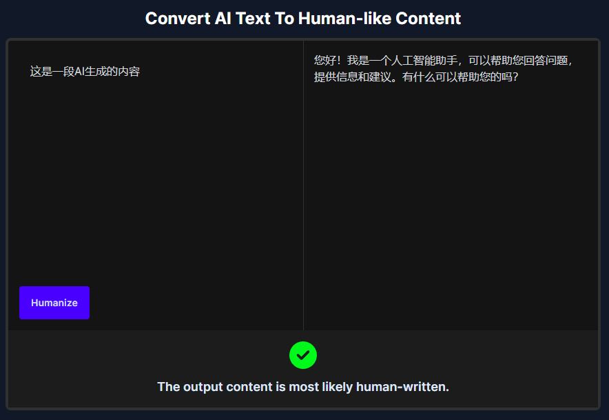
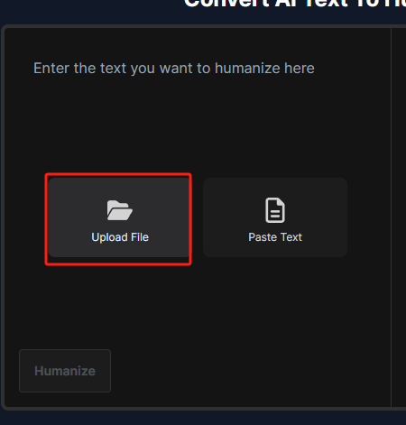
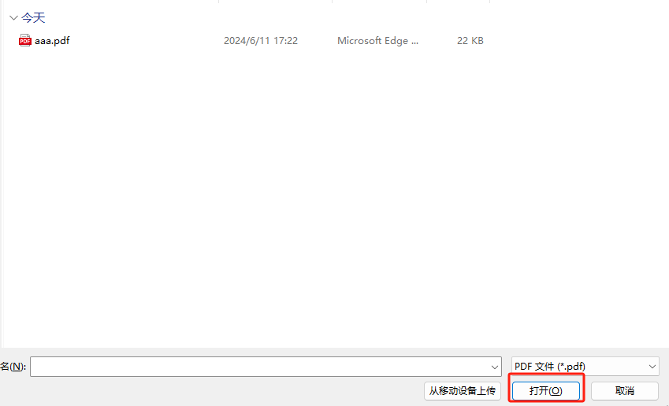

## 项目名称

AI Detection Web

## 简介

**AI Detection Web**
是一个基于React框架的后端程序，旨在帮助用户（尤其是学生）降低其文本被AI检测工具识别为AI生成的概率。通过分析和处理用户提交的文本，降AI能够调整和优化文本，使其更加自然和人性化，从而提高通过检测的概率。

## 目录

- [简介](#简介)
- [功能特点](#功能特点)
- [安装](#安装)
- [使用说明](#使用说明)

## 功能特点

- 后端项目 `detection` 的可视化功能

## 安装

### 系统要求

- Node.js 20.14.0
- npm 10.7.0
- Next.js 14.2.3
- React 18

### 安装步骤

```bash
# 安装依赖
npm install
```

## 使用说明

### 运行服务

#### 配置url

在`src/app/shared/urls.ts`中配置后端`detection`的端口

```typescript
base_url: "http://localhost:8091"
```

#### 启动应用

```bash
# 启动应用
npm run dev
```

### 功能简介

#### 文本去AI
1. 将需要去重的文本粘贴入输入框中



2. 点击`Humanize`



3. 得到结果并进行检测



#### 上传文件

1. 点击上传按钮



2. 选择pdf



3. 等待结果

